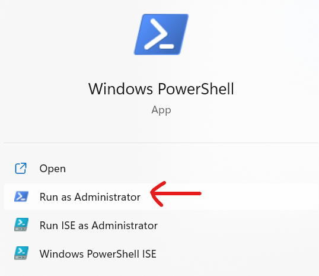
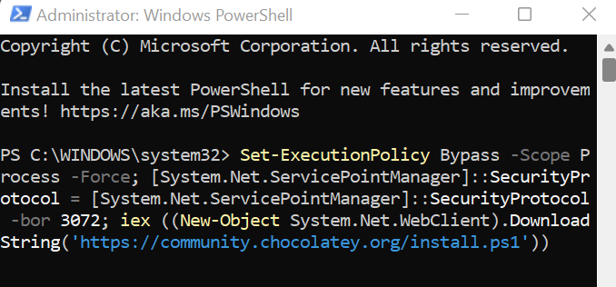
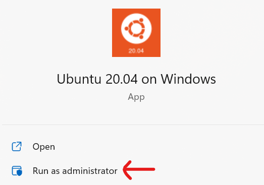
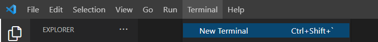
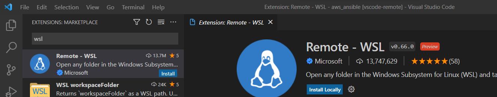
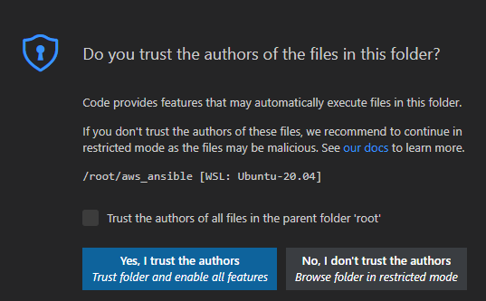

# Ansible Automation in AWS [](https://github.com/ukohae/aws-ansible-automation/actions/workflows/ansible.yml)

## Software Requirement
- `WSL2 ` [Click Here](https://docs.microsoft.com/en-us/windows/wsl/about) to learn more
- `Ansible` [Click Here](https://www.ansible.com/) to learn more
- `AWS CLI`  [Click Here](https://aws.amazon.com/cli/) to learn more
- `Visual Studio Code (IDE)`  [Click Here](https://code.visualstudio.com/) to learn more

### Installation on Windows Machine
- Enable `Hyper-V` <br />
`Windows Settings`
    1. Right-click the Windows button on your desktop and select Apps and Features
    2. Choose `Programs and Features` located on the right.
    3. Choose `Turn Windows features` on or off.
    4. Check the box next to `Hyper-V`, including `Hyper-V Management Tools` and `Hyper-V Platform`, and click `OK`. <br /> <br />

        

- Restart `Windows Computer` <br /> <br />
    

- Open `Powershell as an Administrator` <br /> <br />
        
    - Install `Chocolatey`
        ```
        Set-ExecutionPolicy Bypass -Scope Process -Force; [System.Net.ServicePointManager]::SecurityProtocol = [System.Net.ServicePointManager]::SecurityProtocol -bor 3072; iex ((New-Object System.Net.WebClient).DownloadString('https://community.chocolatey.org/install.ps1'))
        ```
        
        
    - Install `WSL2`
        ```
        choco install WSL2
        ```
    - Install `Ubuntu distro`
        ```
        choco install wsl-ubuntu-2004
        ```
    - Install `Visual Studio Code`
        ```
        choco install vscode
        ```

    -  Search for `Ubuntu 20.04` on your `Windows` and `Run as an Administrator` <br /> <br />
            
        - enter `username` and `password` on the command line.
### After successful Installation

- `Open Visual Studio Code (IDE)`, click on `Terminal`,  select `New Terminal` <br /><br />
 <br /><br />

- Install `WSL extension` on Visual Studio Code <br /><br />


    - Clone `aws_ansible` repository 
        ```
        git clone https://github.com/ukohae/aws_ansible.git
        ```
        
    - If issues persist while cloning the repository on Ubuntu Linux, do the following:
        ```
        sudo rm /etc/resolv.conf
        sudo bash -c 'echo "nameserver 8.8.8.8" > /etc/resolv.conf'
        sudo bash -c 'echo "[network]" > /etc/wsl.conf'
        sudo bash -c 'echo "generateResolvConf = false" >> /etc/wsl.conf'
        sudo chattr +i /etc/resolv.conf
        ```
    - Go into `aws_ansible` directory 
        ```
        cd aws_ansible
        ```
    - open `aws_ansible` folder by typing:
        ```
        code .
        ```
        Select `Trust the authors of all files` checkbox <br /><br />
        

        - Source the virtual environment `venv` folder
            ```
            source venv/bin/activate
            ```

        - Run the following commands in the virtual environment `venv`:
            ```
            sudo apt update -y
            ```
            ```
            sudo apt install python3 python3-pip ipython3 -y
            ```
            ```
            sudo apt install ansible-core -y
            ```
            ```
            pip install awscli
            ```
            ```
            pip install botocore && pip install boto3
            ```

## Verify the following installation:

- `Python3`
    ```
    python3 --version
    ```

- `Ansible `
    ```
    ansible --version
    ```

- `AWS CLI`
    ```
    aws --version
    ```

## AWS Credentials
- Generate `Access Key` and `Secret Keys` from AWS [Click Here](https://us-east-1.console.aws.amazon.com/iam/home?region=us-east-2#/security_credentials)
    - In `WSL2`, do:
        ```
        aws configure
        ```
    - Parse the following: <br />
        `AWS Access Key ID [None]: `<br /> `AWS Secret Access Key [None]: `<br /> `Default region name [None]: ` <br /> `Default output format [None]: `


### Test a Playbook! 
-   On the `Command Line`, run :
    ```
    ansible-playbook virtual_machine_info.yml
    ```
